### CI/CD pipeline with Git, Ansible, Docker, Kubernetes, Jenkins and Google Cloud Platform:

#### [Ansible](ansible/):
- [GCP dynamic inventory](ansible/inventory.gcp.yml)
  - Uses gcp_compute inventory plugin
  - Returns list of GCE instances with `ansible` label grouped by label value
- [Build role](ansible/build-role/)
  - Installs docker
  - Build Docker image from copied Dockerfile
  - Pushes built image to Docker registry
- [Deploy role](ansible/deploy-role/)
  - Installs gcloud, kubectl and helm
  - Creates Helm values based on given environment
  - Gets cluster credentials using provided service account
  - Deploys Helm release from copied chart to cluster
- [build.yml](ansible/build.yml) and [deploy.yml](ansible/deploy.yml) playbooks are used to run roles
- [ansible.dockerfile](ansible/ansible.dockerfile) is used to build an image for Jenkins jobs 

#### [Docker registry Helm chart](docker-registry-chart/):
Templates:
- [Secret](docker-registry-chart/templates/auth-secret.yaml) containing given `htpasswd` file for authentication
- [Secret](docker-registry-chart/templates/certs-secret.yaml) containing given TLS certificate and key
- [Secret](docker-registry-chart/templates/sa-secret.yaml) containing given service account key with permissions to GCS bucket
- [Deployment](docker-registry-chart/templates/deployment.yaml)
  - 2 replicas
  - `registry:2` image
  - Generated HTTP secret for coordinating uploads
  - Environment variables from created secrets
- [Service](docker-registry-chart/templates/service.yaml) exposes pods on HTTPS port `443` and creates NEG for Load Balancer
- [Ingress](docker-registry-chart/templates/ingress.yaml) creates Internal HTTPS Load Balancer with given static IP and TLS certificate from secret
- [Helpers file](spring-petclinic-chart/templates/_helpers.tpl) contains templates for defining labels and selectorLabels for resources.

#### [Jenkins](jenkins/):
Installed by [Helm chart](https://github.com/jenkinsci/helm-charts) with the next Values:
- [config.yaml](jenkins/config.yaml) configures using [JCasC](https://www.jenkins.io/projects/jcasc/) plugin:
  - Jenkins image built from [jenkins.dockerfile](jenkins/jenkins.dockerfile). This image installs required plugins from [plugins.txt](jenkins/plugins.txt) and trusts Docker registry certificates
  - Internal Ingress for accessing Jenkins and External ingress for GitHub webhook
  - Users and their permissions
  - Ansible agent
- [credentials.yaml](jenkins/credentials.yaml) creates Jenkins credentials from corresponding Kubernetes secrets
- [pipelines.yaml](jenkins/pipelines.yaml) creates next Jobs and Pipelines using [JobDSL](https://plugins.jenkins.io/job-dsl/) plugin:
  - `build-job` runs Ansible Build role on Ansible agent
  - `deploy-job` runs Ansible Deploy role on Ansible agent
  - `build-pipeline` - Multibranch pipeline that runs [build.jenkinsfile](jenkins/build.jenkinsfile) on `docker` and `openjdk` containers. Triggered on Pull Requests and push to `main` or `develop` branches. If the build is successful `deploy-pipeline` will be built
  - `deploy-pipeline` runs [deploy.jenkinsfile](jenkins/deploy.jenkinsfile) on `gcloud-helm` container built from [gcloud-helm.dockerfile](jenkins/gcloud-helm.dockerfile). Uses [Active Choices plugin](https://plugins.jenkins.io/uno-choice/) with Groovy script that returns Docker image tag list instead of [Image Tag Parameter plugin](https://plugins.jenkins.io/image-tag-parameter/) that doesn't support self-signed certificates

#### [Spring petclinic Helm Chart](spring-petclinic-chart/):
Templates:
- [Deployment](spring-petclinic-chart/templates/deployment.yaml)
  - Deploys given `spring-petclinic` image
  - If `mysql.cloudsqlProxy` is true `cloud-sql-proxy` sidecar is deployed for connecting to Cloud SQL database on private IP by Cloud SQL Auth Proxy. Otherwise `mysql` container is deployed.
  - Uses created `sql-proxy-sa` Kubernetes Service Account
- [Service](spring-petclinic-chart/templates/service.yaml) exposes pods on HTTP port `8080`
- [Ingress](spring-petclinic-chart/templatesingress.yaml) creates Internal or External HTTPS Load Balancer depending on `loadBalancer.type` value.
- [Managed Certificate](spring-petclinic-chart/templates/managed-cert.yaml) creates Google-managed SSL certificate for External Load Balancer
- [Service Account](spring-petclinic-chart/templates/service-account.yaml) is allowed to impersonate the IAM service account from annotation.
- [Horizontal Pod Autoscaler](spring-petclinic-chart/templates/hpa.yaml) automatically scales Deployment to match demand.
- [Helpers file](spring-petclinic-chart/templates/_helpers.tpl) contains templates for defining labels and selectorLabels for resources.

#### [Terraform](terraform/):
I mostly used Google Cloud Foundation Toolkit [Terraform modules](https://cloud.google.com/docs/terraform/blueprints/terraform-blueprints) for provisioning Google Cloud Platform resources:
- VPC
- Subnet with secondary ranges 
- Firewall rule for internal subnet traffic
- Firewall rule for SSH connection from GKE cluster pods to `ansible` nodes
- Cloud router and NAT
- Private GKE cluster with 2 node pools
- Service account with Cloud SQL Client role and Workload Identity User binding with Kubernetes Service Account `sql-proxy-sa` in `petclinic-ci` namespace
- Service accounts:
  - `ansible-control-node` - used by Ansible to create inventory
  - `docker-registry-storage` - used by Docker registry to access GCS bucket
  - `gke-deploy` - used to deploy Helm charts to GKE clusters
  - `os-login` - used to connect to instances by SSH
- `ansible-managed-node` service account used by Ansible managed node GCE instances
- Grant `os-login` service account `iam.serviceAccountUser` role on `ansible-managed-node` service account
- `wireguard` service account used by Wireguard server GCE instance
- Grant `os-login` service account `iam.serviceAccountUser` role on `wireguard` service account
- Grant `ansible-control-node` service account `compute.viewer` role
- Grant `os-login` service account `compute.osAdminLogin` role
- Grant `gke-deploy` service account `container.developer` role
- GCS Bucket with random name suffix
- Grant `docker-registry-storage` `storage.objectAdmin` role on GCS bucket
- Private Service Access for connecting to Cloud SQL by Private IP
- MySQL Cloud SQL instance, user and database
- Instance Template for running Ansible Build role
- Compute instance from Build Instance Template
- Instance Template for running Ansible Deploy role
- Compute instance from Deploy Instance Template
- DNS private zone
- Private addresses and corresponging DNS records of Docker registry, Jenkins and QA endpoints
- Regional public address for Wireguard server
- Global public address for spring-petclinic and Jenkins webhook endpoints
- DNS public zone and DNS record of spring-petclinic
- DNS forwatding policy
- Wireguard server Instance Template
- Wireguard server Compute Instance with [startup script](terraform/wireguard-script.sh)
- Firewall rule for connecting to Wireguard server

#### [Certificates](certs/):
Install and trust TLS certificates using:
- [Ansible playbook](certs/ansible.yml) on all Ansible managed nodes
- [Kubernetes DaemonSet](certs/kubernetes.yaml) on Kubernetes cluster

I used Wireguard VPN server to access my VPC. I chose Wireguard because I need client-to-site connection and it's relatively easy to setup compared to OpenVPN and other VPN protocols.
I got free domain for spring-petclinic CI Load Balancer IP from Freenom Domain Provider.

Spring-petclinic image is built from [spring-petclinic.dockerfile](spring-petclinic.dockerfile).

#### Install steps:
- Clone GitHub repo:
```
git clone https://github.com/Pienskoi/DevOpsProject.git
```
- `gcloud`, `docker`, `kubectl`, `helm`, `ansible` and `wireguard` should be installed. You must be logged in to `gcloud` with the required permissions. 
- Run [setup-pipeline](setup-pipeline) script from repo folder:
```
cd DevOpsProject
chmod +x ./setup-pipeline
./setup-pipeline
```
You can specify variables by entering them one after the other after calling the script or passing them as arguments in the `KEY=VALUE` style, or both:
```
./setup-pipeline PROJECT_ID=devops-project-12345 REGION=europe-west1
```
- Add nameservers from script output to domain config
- Create GitHub webhook with Push and Pull Request events to URL from script output
- Jenkins UI is accessible on `jenkins.project.com` on VPN
- QA environment will be accessible on `qa.project.com` on VPN
- CI environment will be accessible on provided global domain. You may need to wait some time before Google-managed SSL certificates are created and provisioned.

### Results

#### Jenkins:
Security config:

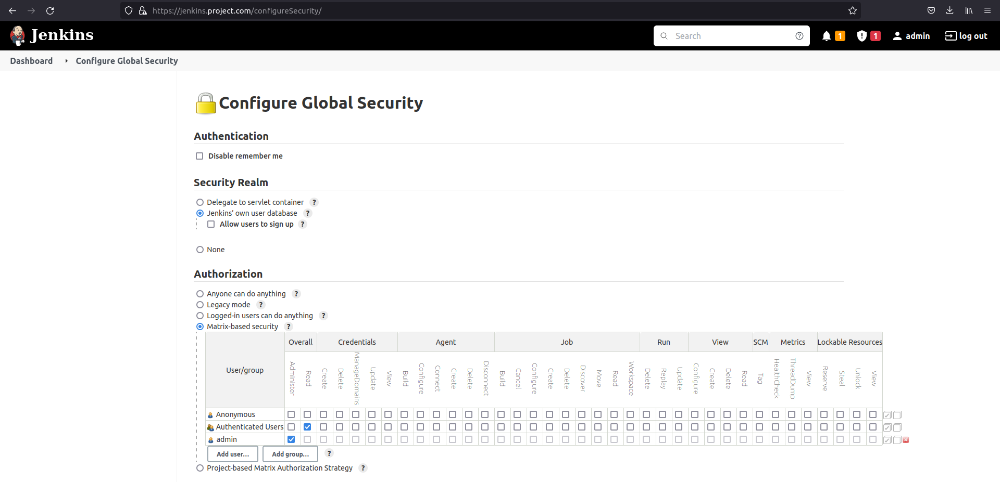

Credentials:

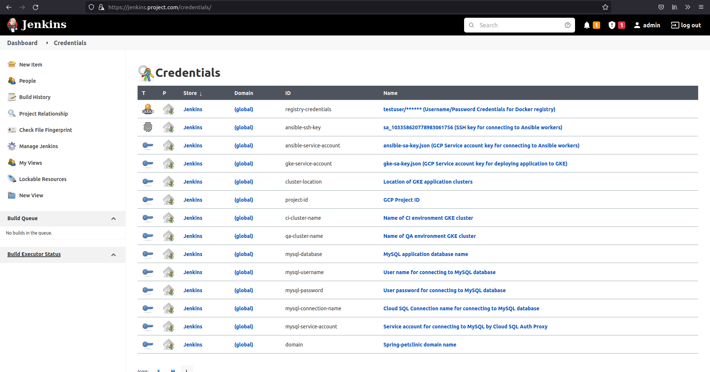

Kubernetes Cloud Agents:

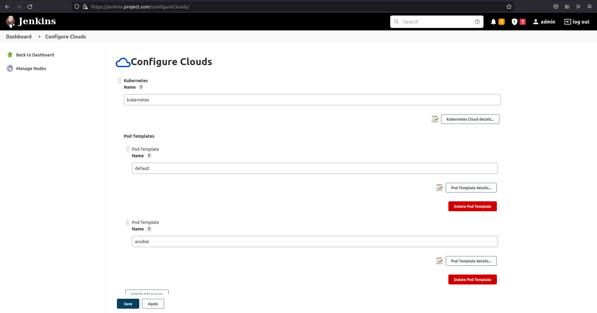

Jobs and Pipelines:

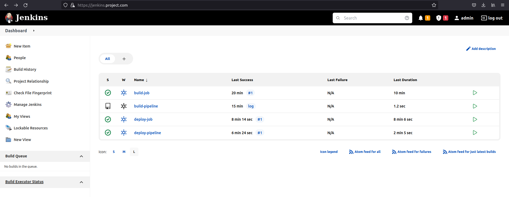

Deploy parameters:

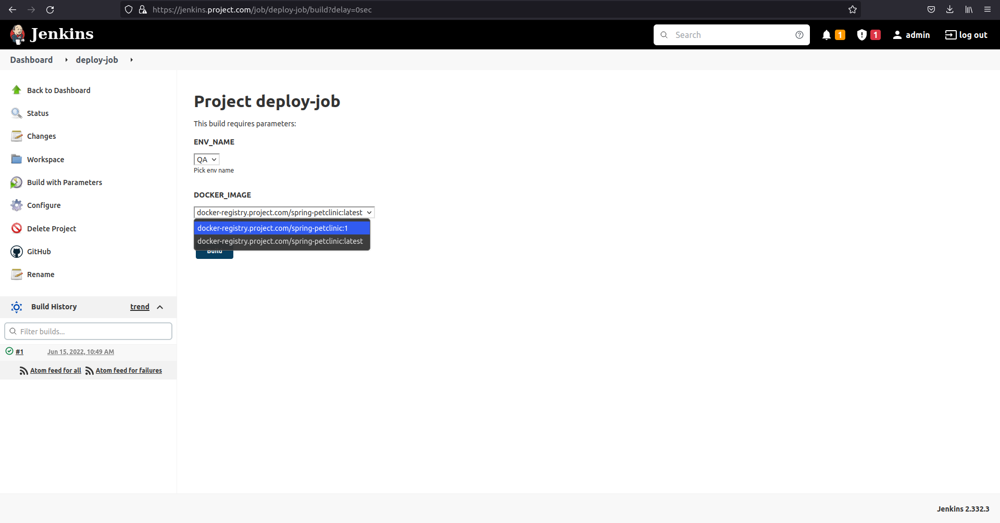
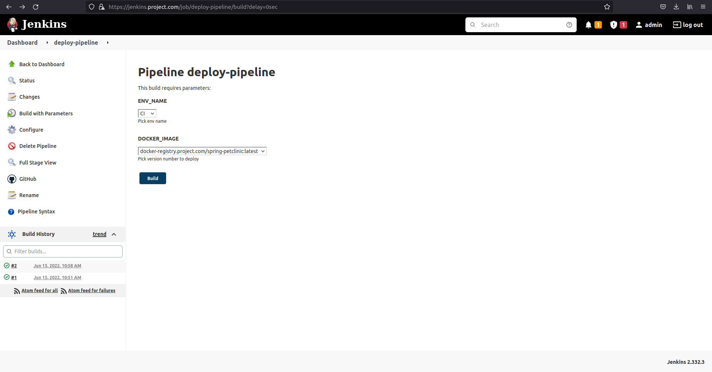

Build pipeline:

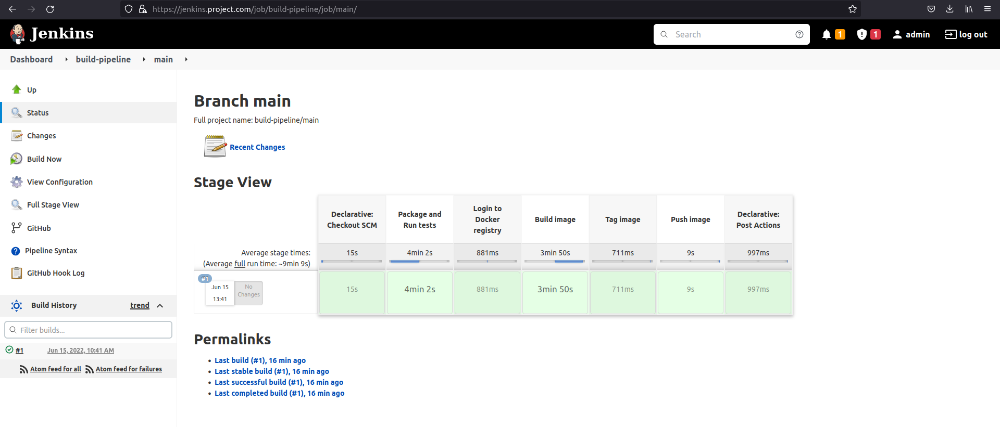

Deploy pipeline:

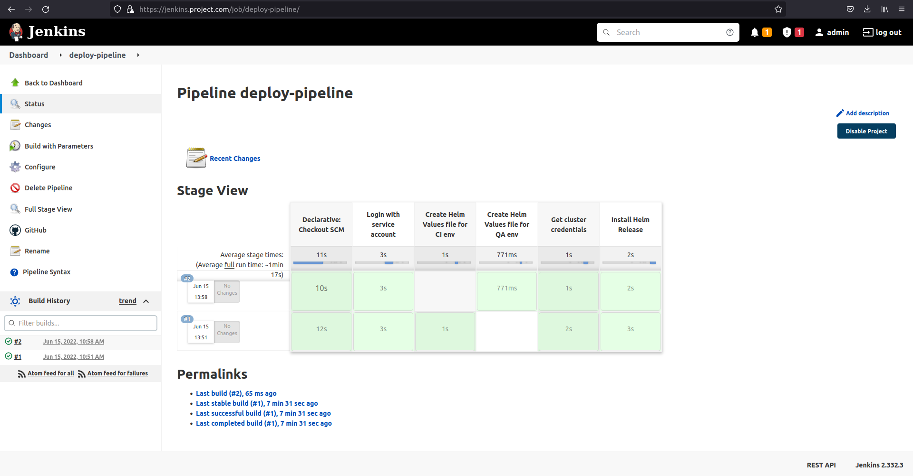

#### GCP Resources:
Kubernetes Engine cluster:

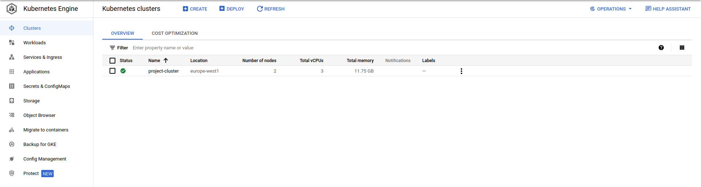
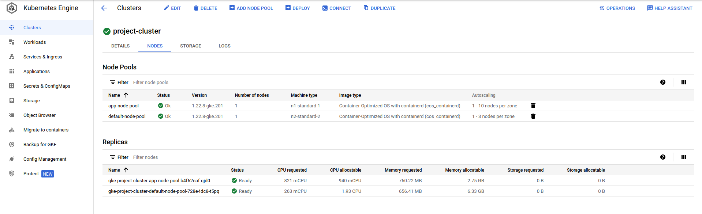

Kubernetes Engine Workloads after deploying all environments:

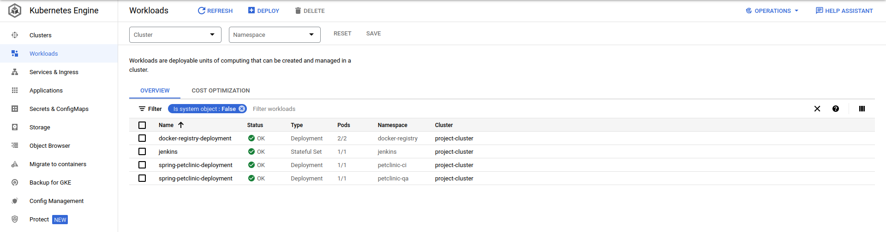

Kubernetes Engine Ingresses after deploying all environments:


Load Balancers after deploying all environments:

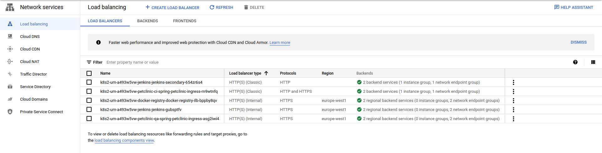

Compute engine VM instances:

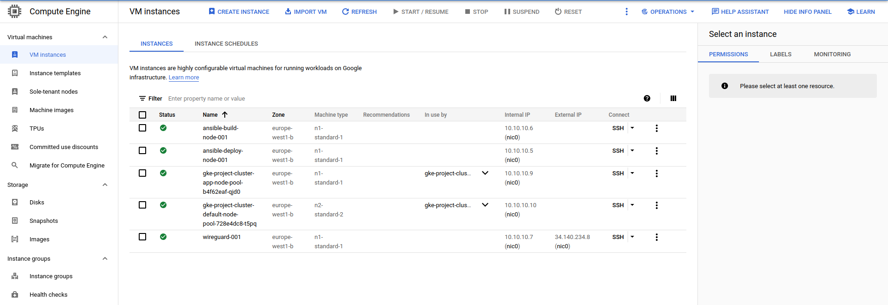

Cloud Storage Bucket with Docker registry images:

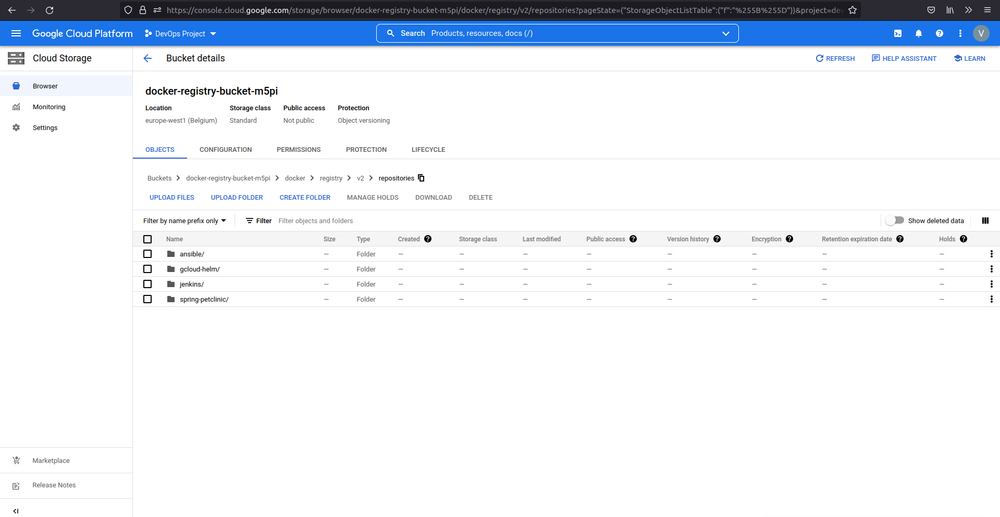

Cloud SQL instance:

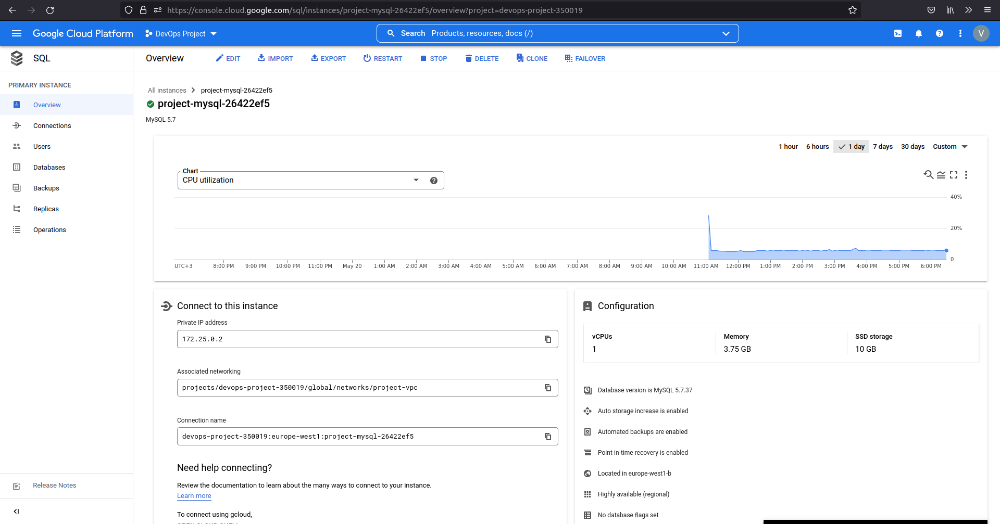

Google-managed SSL certificate for External Load Balancer:

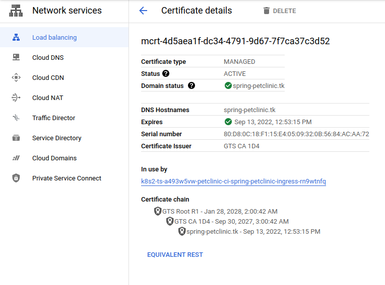

#### Spring-petclinic deployment:
Freenom domain Nameservers config:

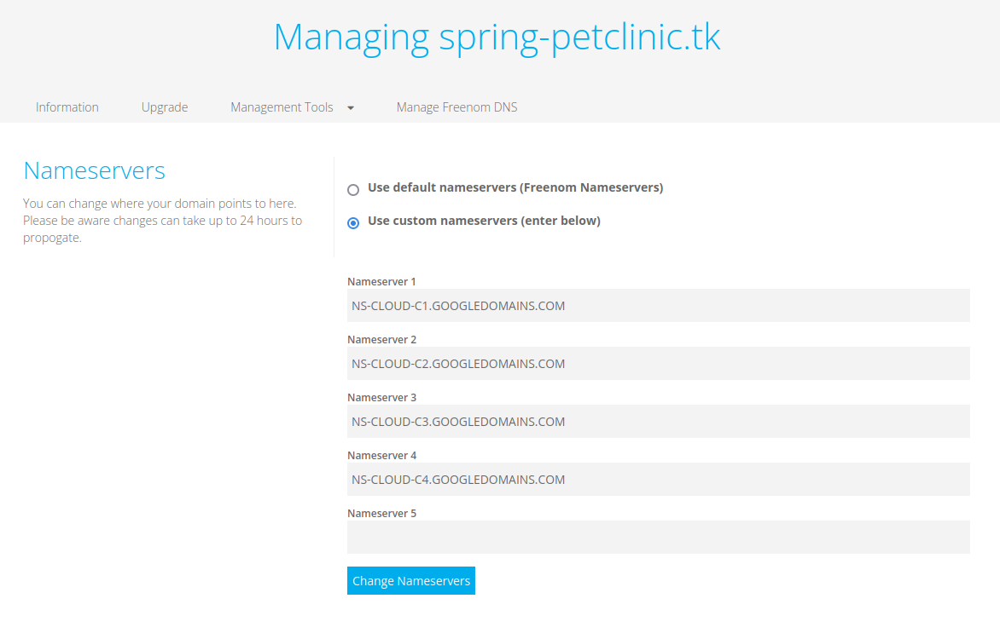

CI environment:

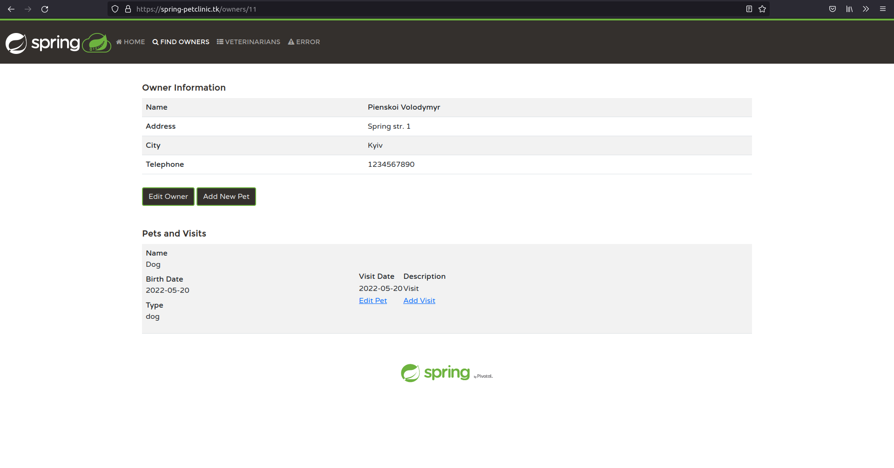

QA environment:

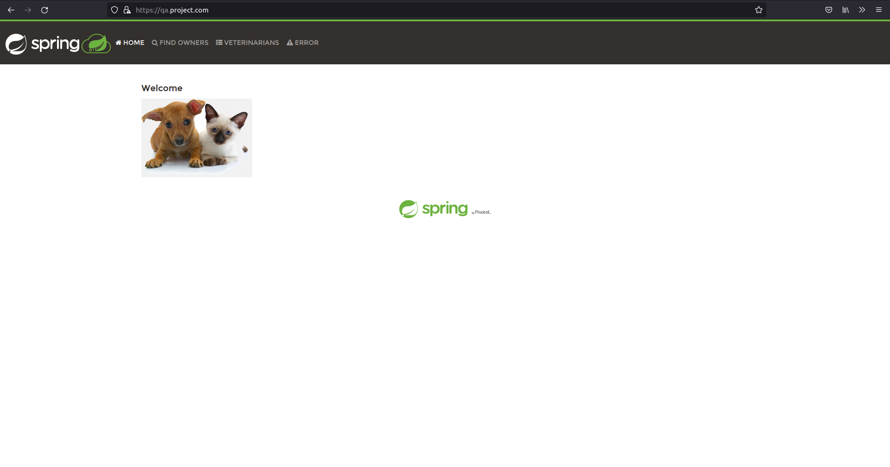

### Alternative CI/CD pipeline with Cloud Build and Artifact Registry:

Alternative variant of CI/CD pipeline that replaces Jenkins and Docker registry with Cloud Build and Artifact Registry services located in [cloud-build](cloud-build/) directory.  
It uses the same Spring petclinic [Helm Chart](spring-petclinic-chart/) and [Dockerfile](spring-petclinic-chart/). [Terraform module](cloud-build/terraform/) and [Setup script](cloud-build/setup-pipeline) include changes described below.

#### Cloud Build:
[Build](cloud-build/build.yaml):
- Package with Maven.
- Build Docker image with latest and shortened commit SHA tags.
- Package Helm chart.
- Retrieve Helm chart version from Chart.yaml file.
- Push Helm chart to Artifact Registry OCI repository.
- Trigger `deploy-ci` build if triggered on push to `main` branch.
- Push Docker images from `images` list to Artifact Registry Docker repository.
- Artifact Registry repository URL should be specified in `_ARTIFACT_REGISTRY_REPO` substitution.

[Deploy CI](cloud-build/deploy-ci.yaml):
- Create `values.yaml` file.
- Deploy Helm release to GKE cluster in `petclinic-ci` namespace.
- MySQL credentials, SQL proxy connection details and domain are secrets stored in Secret Manager.
- Required substitutions:
  - `_IMAGE` - Docker image URL with tag stored in Artifact Registry
  - `_CHART` - Helm chart URL stored in Artifact Registry
  - `_CHART_VERSION` - Helm chart version
  - `_CLUSTER` - GKE cluster name where Helm chart will be deployed
  - `_CLUSTER_REGION` - GKE cluster region where Helm chart will be deployed
  - `_PRIVATEPOOL` - Cloud Build private worker pool ID

[Deploy QA](cloud-build/deploy-qa.yaml):
- Create `values.yaml` file.
- Deploy Helm release to GKE cluster in `petclinic-qa` namespace.
- Required substitutions:
  - `_IMAGE` - Docker image URL with tag stored in Artifact Registry
  - `_CHART` - Helm chart URL stored in Artifact Registry
  - `_CHART_VERSION` - Helm chart version
  - `_CLUSTER` - GKE cluster name where Helm chart will be deployed
  - `_CLUSTER_REGION` - GKE cluster region where Helm chart will be deployed
  - `_MYSQL_DATABASE` - MySQL database name
  - `_MYSQL_USERNAME` - MySQL user name
  - `_MYSQL_PASSWORD` - MySQL user password
  - `_PRIVATEPOOL` - Cloud Build private worker pool ID

#### Terraform:
Removed: modules, resources and outputs related to Ansible, Jenkins and Docker registry.  
Added:
- `cloudbuild-build` and `cloudbuild-deploy` service accounts with needed permissions for corresponding Cloud Build builds.
- Artifact Registry repository for Docker images and Helm charts.
- `cloudbuild-vpc` VPC network.
- Peering of Cloud Build worker pool Google-managed network with created `cloudbuild-vpc`.
- Export custom routes in GKE and Cloud Build peerings.
- Cloud Build Worker Pool.
- `project-vpc` to `cloudbuild-vpc` Cloud HA VPN with advertised routes.
- Cloud Build triggers:
  - `build-push` GitHub push trigger
  - `build-pr` GitHub Pull Request trigger
  - `deploy-ci` Manual trigger
  - `deploy-qa` Manual trigger
- Secret Manager secrets and versions.

#### Setup script:
Removed: commands and arguments related to Ansible, Jenkins and Docker registry.  
Added:
- Enabling of Cloud Build, Container Registry, Artifact Registry and Secret Manager services.
- Pushing [Helm Cloud Builder Community](https://github.com/GoogleCloudPlatform/cloud-builders-community/tree/master/helm) image to Container Registry by submitting Cloud Build.
- Confirmation prompt that GitHub repository is connected to Cloud Build.
